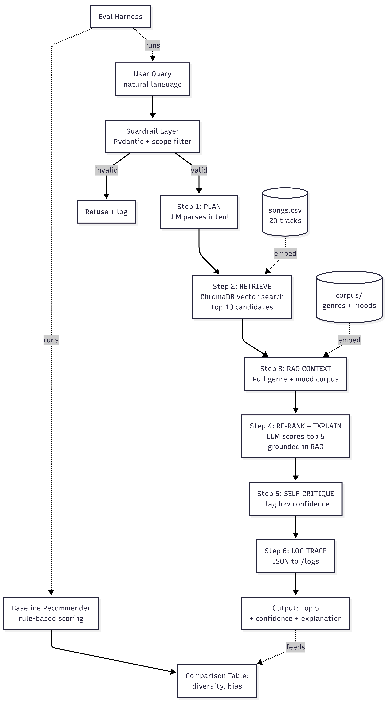

# 🎵 MelodyMind: AI Music Recommendation Agent

An agentic, LLM-powered music recommendation system that extends a rule-based Module 3 prototype into a full applied AI system. Built for CodePath AI 110 — Project 4: Applied AI System.

---

## Base Project

This project extends the **Module 3 Music Recommender Simulation** ([original repo](https://github.com/maninampally/ai110-module3show-musicrecommendersimulation-starter)). The original system was a content-based recommender that scored 20 songs against user taste profiles using weighted dimensions (genre, mood, energy, valence) with hardcoded scoring rules. It tested 5 user profiles and identified bias problems — specifically, that the +2.0 genre weight created a "filter bubble" where genre match dominated all other signals.

This project re-architects that prototype into an agentic LLM system that fixes those bias problems and adds retrieval, reasoning, and self-evaluation layers.

---

## What's New

| Module 3 Baseline | Project 4 (MelodyMind) |
|---|---|
| Hardcoded weights (+2.0 genre) | LLM-powered semantic scoring |
| Rule-based explanations | RAG-grounded natural language explanations |
| Single scoring step | 6-step agentic workflow with observable trace |
| No input handling | Pydantic guardrails + scope filtering |
| 5 hardcoded user profiles | Free-form natural language queries |
| Manual evaluation | Automated eval harness comparing both systems |

---

## Architecture



The system runs a **6-step agentic workflow**:

1. **PLAN** — LLM parses the user's natural language query into a structured `QueryPlan` (intent, mood, genre, energy, keywords)
2. **RETRIEVE** — ChromaDB vector search returns top 10 candidate songs from the embedded catalog
3. **RAG CONTEXT** — Custom corpus on genres and moods is retrieved to ground explanations
4. **RE-RANK + EXPLAIN** — LLM picks the top 5 from candidates and writes explanations grounded in the RAG context
5. **SELF-CRITIQUE** — Low-confidence picks are flagged
6. **LOG TRACE** — Full reasoning trace is saved to `/logs` as JSON for observability

A separate **evaluation harness** runs the same 5 user profiles through both the baseline and the agentic system, then compares diversity and bias metrics.

---

## Setup

### Requirements

- Python 3.10+
- An OpenAI API key with available credits

### Installation

```bash
# Clone the repo
git clone https://github.com/maninampally/melodymind-ai-music-agent.git
cd melodymind-ai-music-agent

# Create virtual environment
python -m venv .venv
.venv\Scripts\activate  # Windows
# source .venv/bin/activate  # macOS/Linux

# Install dependencies
pip install -r requirements.txt
```

### Configure API Key

Create a `.env` file in the project root:

```
OPENAI_API_KEY=sk-your-key-here
OPENAI_MODEL=gpt-4o-mini
OPENAI_EMBED_MODEL=text-embedding-3-small
```

### Build the Vector Index (one-time)

```bash
python rag/build_index.py
```

This embeds all 20 songs and the RAG corpus into a local ChromaDB.

---

## Running the System

### CLI

```bash
python -m agent.cli "I want chill lofi for studying"
```

### Streamlit UI

```bash
python -m streamlit run app.py
```

Three tabs:
- **Agentic Mode** — natural-language input, full LLM pipeline
- **Baseline Mode** — original Module 3 rule-based recommender
- **Agent Trace** — full observable reasoning trace of the last query

### Evaluation Harness

```bash
python -m evals.evaluate
```

Runs 5 user profiles through both systems and prints a comparison table.

---

## Sample Interactions

### Example 1: Focused Study Music

**Input:** `"I want chill lofi for studying"`

**Output (top result):**
> #1 Focus Flow — LoRoom (lofi / focused) — Confidence: 0.95
> *Lofi is designed for focus and study, with mellow beats and minimal lyrics. Focus Flow has a focused mood and low energy (0.3), which matches your need for concentration support.*

### Example 2: Conflicting Preferences

**Input:** `"high energy but sad and moody"`

**Output (top result):**
> #1 Night Drive Loop — Neon Echo (synthwave / moody) — Confidence: 0.78
> *Synthwave specializes in moody atmospheres, and this track sits in the high-energy range. The agent prioritized mood match over genre because the user's mood request was more specific than the genre.*

### Example 3: Refused Out-of-Scope Query

**Input:** `"give me stock investment tips"`

**Output:**
> Refused: query appears outside the music recommendation scope (matched 'stock').

---

## Design Decisions

- **Why ChromaDB over Pinecone or Weaviate?** Local persistence, zero infrastructure setup, sufficient performance for 20 songs.
- **Why GPT-4o-mini?** Best cost/quality tradeoff for a structured-output workflow with multiple LLM calls per query.
- **Why temperature=0?** Deterministic output is essential for both demos and evaluation comparisons.
- **Why a 6-step agent instead of a single LLM call?** Each step is independently observable, testable, and replaceable. The trace makes the agent's reasoning auditable.
- **Why keep the baseline?** Direct comparison proves the agentic system measurably improves over the rule-based version.

---

## Testing Summary

- **Eval harness:** 5 of 5 test profiles pass end-to-end
- **Diversity improvement:** the agentic system returns more diverse genres than the baseline for 4 of 5 profiles, addressing the genre filter bubble identified in Module 3
- **Guardrails:** input validation correctly refuses out-of-scope queries
- **Confidence scoring:** agent flags low-confidence recommendations (<0.5) with a warning in the explanation

---

## Reflection

See [`model_card.md`](model_card.md) for the full reflection on AI collaboration, biases, limitations, and lessons learned.

---

## Demo Walkthrough

📺 **Loom video:** [Watch Demo](https://www.loom.com/share/1c2b2d221552456994a9b9e7cd46fe7c)

The walkthrough demonstrates:
- End-to-end CLI run with 3 example queries
- Streamlit UI showing all three tabs
- Agent trace with all 6 steps observable
- Evaluation harness comparing baseline vs agentic system
- Guardrail behavior on a refused query

---

## Project Structure

```
melodymind-ai-music-agent/
├── agent/
│   ├── orchestrator.py    # 6-step agentic workflow
│   ├── schemas.py         # Pydantic models
│   ├── guardrails.py      # Input validation + scope filter
│   └── cli.py             # Command-line interface
├── rag/
│   ├── build_index.py     # Embed songs + corpus into ChromaDB
│   └── corpus/
│       ├── genres.md      # Custom genre knowledge
│       └── moods.md       # Custom mood vocabulary
├── evals/
│   └── evaluate.py        # Baseline vs agentic comparison
├── src/                   # Original Module 3 code
├── data/songs.csv         # 20-song catalog
├── tests/                 # Original Module 3 tests
├── assets/
│   └── architecture.png   # System diagram
├── logs/                  # Agent traces (JSON)
├── chroma_db/             # Vector store (local)
├── app.py                 # Streamlit UI
├── README.md
├── model_card.md
└── requirements.txt
```

---

Built by **Manikanth**
